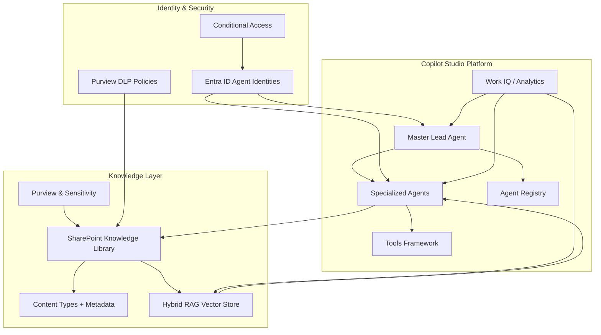

# Copilot Studio Dream Team Setup Guide v3.1 – Enterprise Multi-Agent Framework

> **Version:** v3.1 — May 2026
> 
> **Target reader:** senior architect / implementation lead building enterprise-scale Copilot Studio with hybrid RAG, SharePoint metadata governance, Entra identity management, and production-grade multi-agent orchestration.

## 1. Executive Summary

This guide defines a production-ready Copilot Studio architecture for enterprise deployments in May 2026. It is not a conceptual manifesto: it is an implementation playbook for teams that need to deploy a secure, governable multi-agent Collaborative AI platform with:

- Native Copilot Studio RAG and Work IQ
- Advanced SharePoint metadata, content types, and metadata navigation
- Entra ID agent identities and enterprise identity governance
- Purview DLP + sensitivity labels across content, agents, and outputs
- Connected and child agent orchestration with Tools Framework integration
- Evaluation, analytics, and lifecycle maintenance

The recommended design is a layered `Master Lead → Specialized Agent Pods → Knowledge Layer` architecture that keeps agent routing explicit, content taxonomy strict, and risk controls enforceable. This guide delivers system architecture, concrete configuration templates, SharePoint structure recommendations, setup checklists, and a real workflow example for a financial services agent build.

## 2. Quick Start

### Realistic time to production-ready pilot

- **Initial enterprise pilot:** 4–6 weeks
- **First functional Copilot Studio deployment with hybrid RAG:** 8–10 weeks
- **Production rollout with governing policies and analytics:** 12–14 weeks

### Minimum viable start

1. Reserve SharePoint Online tenant and create a dedicated site collection for `CopilotStudio`
2. Enable Microsoft Purview Sensitivity Labels and DLP policies for the target tenant
3. Configure Copilot Studio tenant access and Entra ID service principals
4. Build the first `Master Lead` agent and register it in the Copilot Studio agent registry
5. Create the core SharePoint content types / metadata model
6. Populate initial vectorized knowledge sources and test a simple RAG pipeline
7. Connect Work IQ and validation dashboards for agent output monitoring

### What must exist before you start

- Microsoft 365 tenant with SharePoint Online and Copilot Studio enabled
- Entra ID and Microsoft Purview licenses for the environment
- Copilot Studio agent onboarding permission and workspace admin access
- Data classification policy and initial sensitivity labels defined
- Dev/test target site collection with at least two document libraries:
  - `AgentKnowledge`
  - `GovernanceArtifacts`

## 3. System Architecture

### High-level architecture



### Architecture explanation

- **Master Lead Agent** is the central orchestration brain. It owns agent routing, policy enforcement, and escalation decisions.
- **Specialized Agents** are grouped into pods by capability: Knowledge, RAG, Security, SharePoint Metadata, Analytics, and Domain Delivery.
- **Tools Framework** is how agents interact with systems: SharePoint APIs, RAG vector store connectors, Purview SDK, Work IQ telemetry, and external enterprise systems.
- **Agent Registry** stores metadata for agents, identities, capabilities, allowed tools, and evaluation histories.
- **Knowledge Layer** is enterprise content governance: SharePoint libraries, metadata schema, and hybrid RAG index. It is the source of truth for prompt context.
- **Identity & Security** ensures each agent has a managed Entra identity, just-in-time access, and explicit policy attachments.
- **Work IQ / Analytics** measures usage, drift, response quality, policy violations, and output evaluation.

### Practical run-time flow

1. User request arrives in Copilot Studio
2. Master Lead evaluates the request type, data sensitivity, and current agent load
3. Master Lead selects a child or connected agent pod and attaches the relevant knowledge context
4. The selected agent uses the Tools Framework to query SharePoint metadata, execute a RAG retrieval, or call an external system
5. Output is returned to the user and recorded in Work IQ for evaluation
6. If confidence is low, Master Lead routes the request to a guardrail / review agent before final response

## 4. Agent Registry

The core enterprise Copilot Studio solution should be anchored on a master lead and 6–8 specialized agents. The full team can include up to 140 agents, but these are the essential production roles.

| Agent | Role | Model | Tools | Primary Responsibility |
|---|---|---|---|---|
| Master Lead | Enterprise orchestration and governance | Copilot Studio Unified + custom system prompt | Copilot Studio routing, Tools Framework, Agent Registry | Agent routing, policy enforcement, escalation, audit trail |
| Knowledge Architect | SharePoint metadata and content model design | Copilot Studio Knowledge | SharePoint REST/Graph, Content Type API, Purview API | Define taxonomy, content types, metadata navigation, knowledge boundaries |
| RAG Specialist | Hybrid retrieval optimization | Copilot Studio RAG | Vector store connector, Azure OpenAI/GPT retrieval, SharePoint connector | Build retrieval pipelines, prompt templates, source weighting, freshness controls |
| Orchestration Engineer | Child/Connected agent pipeline design | Copilot Studio Orchestrator | Tools Framework, agent-to-agent messaging, evaluation hooks | Construct agent workflows, error handling, dynamic routing, lifecycle orchestration |
| Security & Compliance Auditor | DLP, sensitivity, audit | Copilot Studio Security | Entra ID, Purview, DLP policy scanner, audit log access | Validate policies, enforce labels, approve sensitive responses, manage entitlements |
| Work IQ Analyst | Usage analytics and evaluation | Copilot Studio Insights | Work IQ, telemetry dashboards, evaluation APIs | Diagnose drift, track agent adoption, define evaluation metrics |
| SharePoint Metadata Architect | Advanced metadata navigation | Copilot Studio Knowledge | SharePoint taxonomy, term store, content types | Configure metadata columns, navigation hierarchies, dynamic views, retention labels |
| Enterprise Domain Agent | Business domain delivery | Copilot Studio Agents | Domain-specific tools, data connectors, RAG sources | Deliver domain outcomes such as finance, HR, legal support, sales enablement |

### Why this registry matters

This set of agents keeps the implementation realistic while aligning with actual Copilot Studio capabilities. The Master Lead is not a generic model; it is a concrete orchestrator that knows which child agent to activate for each request and how to attach the right SharePoint metadata context.

## 5. Master Lead – Complete Configuration

### Master Lead purpose

The Master Lead is the only agent with direct routing authority for production requests.

### System prompt for Master Lead

```text
You are **Master Lead** for the Copilot Studio Dream Team. Your mission is to route enterprise user requests to the correct specialized agent, enforce security and metadata policy, and ensure output quality before returning responses. Use explicit decision-making. If a request involves sensitive data, automatically route it through the Security & Compliance Auditor. If knowledge retrieval is needed, attach only approved SharePoint content with the correct metadata filters.

Rules:
1. Always validate request type first: knowledge lookup, business process, governance question, or system request.
2. Use the Agent Registry to select child/connected agents by capability and allowed tool sets.
3. Enforce Purview sensitivity labels and DLP before any external call.
4. Use Work IQ telemetry to decide whether to cache or rehearse the response.
5. Log every route, tool call, metadata access, and evaluation score in the audit trail.
6. If confidence is below 80% or if the answer touches `Confidential` or `Highly Confidential`, escalate to the Compliance Auditor.
7. Never bypass SharePoint metadata filters for enterprise or regulated content.

Output format:
- `route`: agent name
- `reason`: routing rationale
- `context`: content sources, metadata security tags
- `tool_calls`: list of tools used
- `evaluation_required`: yes/no
```

### Key topics Master Lead must own

- Agent selection and handoff logic
- Classification of user intent
- Metadata context selection and sanitization
- Sensitivity label enforcement
- Child agent orchestration patterns
- Error and fallback handling
- Audit and evaluation gating

### Orchestration logic example

1. User asks for a finance policy summary
2. Master Lead tags request: `domain=finance`, `sensitivity=internal`, `knowledge=SharePoint`
3. Master Lead chooses `Enterprise Domain Agent (Finance)` and `RAG Specialist`
4. It supplies the child agent with:
   - `SourceLibrary=CopilotStudio/AgentKnowledge`
   - `MetadataFilter=BusinessUnit eq 'Finance' AND ContentType eq 'Policy'`
   - `SensitivityLabel` from Purview
5. If `SensitivityLabel=Confidential`, require `Security & Compliance Auditor` review
6. After child agent response, run `Evaluation Hook` with `Work IQ Analyst`
7. Return final answer with a compliance summary and source citations

### Routing examples

- **New agent creation / onboarding request**
  - route: `Orchestration Engineer`
  - reason: design, agent registration, connected agent topology
- **“Find the latest contractual approval process”**
  - route: `RAG Specialist` + `Knowledge Architect`
  - reason: advanced metadata filter + SharePoint retrieval
- **“Can this customer file be shared externally?”**
  - route: `Security & Compliance Auditor`
  - reason: DLP plus sensitivity label verification
- **“Build a mCommerce financial services agent”**
  - route: `Enterprise Domain Agent` + `SharePoint Metadata Architect`
  - reason: domain-specific agent plus content taxonomy design

## 6. Knowledge & RAG Strategy

This section is the most important practical layer.

### SharePoint structure

Use a dedicated SharePoint site collection named `CopilotStudio` with the following libraries:

- `AgentKnowledge` — primary knowledge source for RAG and Copilot Studio usage
- `GovernanceArtifacts` — policies, playbooks, compliance evidence, labeling guidance
- `AgentAssets` — prompts, prompt templates, agent configuration documents, training notes
- `ExternalFeeds` — regulated external content imported via approved connectors

### Recommended content model

#### Primary content types

- `AgentKnowledgeItem`
- `PolicyDocument`
- `AgentBlueprint`
- `ComplianceArtifact`
- `OperationalRunbook`

#### Core metadata columns

| Column | Type | Required | Purpose |
|---|---|---|---|
| `BusinessUnit` | Choice | yes | Finance / HR / Legal / Sales / IT / Ops |
| `KnowledgeDomain` | Managed Metadata | yes | RAG context classification |
| `ContentType` | Choice | yes | Policy / Runbook / FAQ / Procedure / Contract |
| `SourceSystem` | Text | no | ERP / CRM / SharePoint / Teams / Other |
| `SensitivityLabel` | Choice | yes | Public / Internal / Confidential / Highly Confidential |
| `RetentionLabel` | Choice | yes | 1 year / 3 years / 7 years / Permanent |
| `RAGPriority` | Choice | yes | High / Normal / Low |
| `Language` | Choice | yes | en-US / local |
| `EffectiveDate` | Date | no | freshness control |
| `ApprovedBy` | Person or Group | no | compliance sign-off |

#### Metadata navigation

Build navigation on `AgentKnowledge` using:

- `BusinessUnit`
- `KnowledgeDomain`
- `ContentType`
- `SensitivityLabel`

Recommended view structure:

- `AgentKnowledge` → `Finance` → `Policies` → `Internal`
- `AgentKnowledge` → `HR` → `Procedures` → `Confidential`
- `AgentKnowledge` → `Legal` → `Contracts` → `Highly Confidential`

### Naming conventions

Use explicit, machine-friendly names and human-friendly titles.

- Library name: `AgentKnowledge`
- Content type names: `AgentKnowledgeItem`, `PolicyDocument`
- Metadata columns: `BusinessUnit`, `KnowledgeDomain`, `SensitivityLabel`
- Document title format: `[BusinessUnit] [ContentType] — [Short Description]`
- File name format (for uploaded files): `Finance-Policy-Expense-Reimbursement-v1.docx`
- Term store path: `CopilotStudio / KnowledgeDomain / Finance / ProductGovernance`

### Hybrid RAG design

#### Source separation

- Keep a **structured SharePoint corpus** for curated enterprise content.
- Keep a **transient knowledge store** for ephemeral or conversation-specific content, used only by the session RAG state.
- Use **external connectors** only through approved data ingestion jobs, not direct user query.

#### RAG pipeline pattern

1. Ingest content from `AgentKnowledge` into a vector store using metadata-tagged chunks.
2. Store both the text vector and metadata payload:
   - `BusinessUnit`, `KnowledgeDomain`, `SensitivityLabel`, `SourceURI`, `EffectiveDate`, `RAGPriority`
3. Apply a retrieval filter before query time:
   - `SensitivityLabel` <= user clearance
   - `BusinessUnit` and `KnowledgeDomain` match request intent
   - `EffectiveDate` within freshness window if the request is time-sensitive
4. Perform reranking using domain-specific signals: `RAGPriority`, `ApprovalStatus`, `LastReviewedBy`
5. Pass top-3 sanitized snippets to the Copilot Studio responder agent

#### Retrieval optimization

- Prefer `source=` queries over generic concept matching when metadata is strong
- Use a secondary semantic index for “long tail context” where metadata is absent
- Cache vector store query results for repeated enterprise workflows
- Refresh vectors when `EffectiveDate` or `RetentionLabel` changes

### Content quality controls

- Tag sources with `RAGPriority=High` only for enterprise-approved, reviewed content
- Apply a `FirstReview` workflow for any new `AgentKnowledgeItem` before it is included in RAG indexing
- Use `ApprovedBy` + `EffectiveDate` for gating content before it is used by production agents
- Keep a separate `GovernanceArtifacts` library for the current metadata scheme and retention policy documentation

### SharePoint & Copilot Studio integration pattern

- Use SharePoint as the authoritative metadata source and RAG content store.
- Use `Metadata Navigation` to let humans and the `Knowledge Architect` find relevant content quickly.
- Use the same content taxonomy to drive both:
  - Copilot Studio prompt templates
  - RAG filters
  - Work IQ evaluation categories
- Avoid unmanaged file stores for production knowledge. If content sits outside SharePoint, ingest it into the library with matching metadata before it is used.

## 7. Security, Governance & Compliance Framework

### Identity and agent trust

- Provision each agent as a managed Entra ID identity if the platform allows it. If not, use a dedicated service principal per agent class.
- Map agents to least-privilege scopes:
  - `MasterLead` can read metadata and route, but not directly modify `Highly Confidential` content.
  - `RAG Specialist` can read `AgentKnowledge` and vector indexes but not change Purview labels.
  - `Security Auditor` can review and approve responses, and submit compliance verdicts.
- Implement `Conditional Access` for all tool connectors and workspaces.

### Data classification and labeling

- Use Microsoft Purview sensitivity labels on both:
  - SharePoint files and lists
  - Copilot Studio agent prompts, templates, and outputs when applicable
- For `Highly Confidential` content, require both:
  - explicit `SensitivityLabel=Highly Confidential`
  - store-level DLP policy enforcement
- Define label mapping as:
  - `Public` → allow normal RAG access
  - `Internal` → allow enterprise authenticated Copilot Studio only
  - `Confidential` → require Compliance Auditor review
  - `Highly Confidential` → require manual approval before response

### Tool governance and allowed capabilities

| Agent | Allowed tools | Denied tools | Notes |
|---|---|---|---|
| Master Lead | routing, registry, policy engine | direct file editing on `Highly Confidential` | Always validate before route |
| RAG Specialist | SharePoint query, vector search | broad external system access | only read with filters |
| Knowledge Architect | metadata configuration APIs | direct content ingestion | approves ingestion patterns |
| Orchestration Engineer | agent-to-agent messaging, workflow engine | bypass of approval workflows | must use evaluation hooks |
| Security Auditor | Purview API, DLP scanner, audit logs | user-facing response generation | decisions only, no final output without review |
| Work IQ Analyst | telemetry, evaluation scoring | content modification | measures, reports, recommends |

### Compliance checkpoints

- Every new agent definition must pass a `Policy Review` before it goes live.
- Every new knowledge source must be assigned one of the core metadata labels and approved by an owner.
- Every request flagged as `sensitivity=Confidential/Highly Confidential` must be logged in the audit trail with user identity and access justification.
- Use `Work IQ` to detect anomalous query volumes and escalations.

### Purview + DLP practical setup

1. Create a Purview classification policy for `CopilotStudio` with labels matching your SharePoint taxonomy.
2. Enable `Data Loss Prevention` rules on `AgentKnowledge` for sensitive content patterns, including contract numbers, PII, financial account IDs.
3. Configure `access policies` for Copilot Studio connectors so they cannot access `Highly Confidential` libraries without an explicit `Security Auditor` approval token.
4. Use automated label enforcement scripts to detect uncategorized content in `AgentKnowledge`.

### Output auditing and evaluation

- Use Work IQ to record:
  - request category
  - selected agent(s)
  - sources used
  - sensitivity classification
  - final score from evaluation hooks
- Keep a `GovernanceArtifacts` list of `EvaluationResults` documents that include root cause analysis for low-score outputs.
- Weekly audit report should include:
  - policy exceptions
  - new high-sensitivity content ingested
  - top 10 low-confidence responses
  - agent drift indicators

## 8. Orchestration Patterns

### Real practice for Master Lead

#### Pattern 1: Domain-triggered routing

- User intent recognized as `domain=Finance`
- Master Lead chooses:
  - `Enterprise Domain Agent (Finance)` for domain logic
  - `SharePoint Metadata Architect` to resolve metadata filters
  - `RAG Specialist` for retrieval
- The child agents return a draft and cite the three most relevant sources
- Master Lead asks `Security Auditor` if any answer contains `Confidential`
- If safe, Master Lead returns the answer with citations and label context

#### Pattern 2: Guardrail review for high-risk answers

- If the response touches `Highly Confidential` or legal terms, route to `Security Auditor` before the user sees anything
- Output should include a `reviewed_by` stamp and a `compliance_verification` block

#### Pattern 3: Agent-to-agent query escalation

- If `Enterprise Domain Agent` cannot answer from current knowledge, it sends a query to `Knowledge Architect` instead of generating an unsupported response
- The Knowledge Architect can either supply better metadata filters or declare that the needed content is missing

#### Pattern 4: Tools-first response generation

- Use the Tools Framework for deterministic operations first:
  - metadata queries
  - term store lookup
  - label compatibility checks
  - vector search queries
- Only generate natural language after tool results are confirmed

### Child agent workflow examples

- `Child Agent: RAG Specialist`
  - Input: metadata filter, user query, sensitivity label
  - Tools: vector search, SharePoint query API
  - Output: candidate snippets + relevance score

- `Child Agent: SharePoint Metadata Architect`
  - Input: domain, content type, business unit
  - Tools: SharePoint content type API, term store access
  - Output: metadata filter, library path, RAG index path

- `Child Agent: Security & Compliance Auditor`
  - Input: answer draft, sensitivity metadata, source URIs
  - Tools: Purview API, DLP scanner, audit logger
  - Output: approval status, required redactions, safe/unsafe flag

### Orchestration governance loop

- Step 1: Master Lead routes request
- Step 2: child agent generates candidate output
- Step 3: evaluation hook captures score
- Step 4: if score < threshold, Master Lead routes to secondary review or fallback
- Step 5: user receives answer plus compliance summary
- Step 6: analytics record outcome and training signal

## 9. Directory Structure & Naming Conventions

### Recommended SharePoint structure

```
CopilotStudio (Site Collection)
├─ AgentKnowledge (Library)
│  ├─ Finance
│  ├─ HR
│  ├─ Legal
│  ├─ Sales
│  ├─ IT
│  └─ Operations
├─ GovernanceArtifacts (Library)
│  ├─ Policies
│  ├─ Playbooks
│  ├─ AuditReports
│  └─ AgentRegistry
├─ AgentAssets (Library)
│  ├─ Prompts
│  ├─ Templates
│  ├─ AgentConfigurations
│  └─ Onboarding
├─ ExternalFeeds (Library)
│  ├─ PartnerData
│  ├─ RegulatoryFeeds
│  └─ MarketSignals
```

### Project structure for implementation teams

```
copilot-studio-dream-team/
├─ architecture/
│  ├─ system-architecture.md
│  ├─ agent-registry.md
│  ├─ security-governance.md
│  └─ knowledge-model.md
├─ definitions/
│  ├─ master-lead-prompt.md
│  ├─ agent-configs/
│  │  ├─ knowledge-architect.json
│  │  └─ rag-specialist.json
│  └─ metadata-templates/
│     ├─ sharepoint-columns.json
│     └─ content-types.json
├─ runbooks/
│  ├─ setup-checklist.md
│  ├─ release.md
│  └─ incident-response.md
├─ dashboards/
│  ├─ workiq-metrics.md
│  └─ evaluation-criteria.md
└─ scripts/
   ├─ deploy-sharepoint.ps1
   ├─ sync-metadata.ps1
   └─ ingest-rag-data.ps1
```

### Naming convention rules

- Use `PascalCase` for SharePoint content type names and library names.
- Use `camelCase` for field internal names.
- Use `kebab-case` for repo directories and script filenames.
- Use precise prefixes for documents that onboard or govern:
  - `GOV-` for governance documents
  - `AGENT-` for agent definitions
  - `SETUP-` for deployment scripts and checklists
- Avoid ambiguous terms like `General` or `Misc` in metadata values.
- Enforce versioning in file names when content is used for RAG:
  - `Finance-Policy-Expense-Reimbursement-v1.docx`

## 10. Detailed Step-by-step Setup Guide

### Phase 0: Foundation

#### Step 0.1 — Approve environment and licensing

- Confirm Microsoft 365 tenant has Copilot Studio and Purview licenses
- Validate Entra ID tenant policies and appropriate admin roles
- Document `CopilotStudio` site collection and service principals

#### Step 0.2 — Provision SharePoint and metadata skeleton

- Create site collection `CopilotStudio`
- Create libraries: `AgentKnowledge`, `GovernanceArtifacts`, `AgentAssets`, `ExternalFeeds`
- Create content types: `AgentKnowledgeItem`, `PolicyDocument`, `AgentBlueprint`, `ComplianceArtifact`, `OperationalRunbook`
- Create metadata columns listed in Section 6
- Create views for metadata navigation by `BusinessUnit`, `KnowledgeDomain`, and `SensitivityLabel`

#### Step 0.3 — Configure Purview labels and DLP

- Define labels: `Public`, `Internal`, `Confidential`, `Highly Confidential`
- Apply label policies to `AgentKnowledge` and `GovernanceArtifacts`
- Build DLP rules for `Highly Confidential` and `Confidential` content patterns
- Validate label enforcement with a small sample dataset

#### Step 0.4 — Build the initial agent registry

- Create a `GovernanceArtifacts/AgentRegistry` folder in SharePoint
- Register:
  - `MasterLead`
  - `KnowledgeArchitect`
  - `RAGSpecialist`
  - `OrchestrationEngineer`
  - `SecurityAuditor`
  - `WorkIQAnalyst`
  - `SharePointMetadataArchitect`
- Ensure each agent record includes allowed tools and identity mapping

#### Step 0.5 — Build the Master Lead prompt and routing rules

- Create `definitions/master-lead-prompt.md`
- Implement the prompt in Copilot Studio agent configuration
- Add routing rules for the first 10 request categories

#### Step 0.6 — Configure RAG index and ingestion

- Build the ingestion pipeline with metadata-preserving chunks
- Use the same `SensitivityLabel`, `BusinessUnit`, and `KnowledgeDomain` in vector metadata
- Index initial content from `AgentKnowledge`
- Validate retrieval by running 10 test prompts with explicit metadata filters

### Phase 1: Pilot and validation

#### Step 1.1 — Seed the knowledge library

- Load 25–40 enterprise documents into `AgentKnowledge`
- Confirm each document has `BusinessUnit`, `KnowledgeDomain`, `ContentType`, and `SensitivityLabel`
- Assign `RAGPriority=High` only to fully reviewed content

#### Step 1.2 — Build the first domain agent

- Activate `Enterprise Domain Agent (Finance)` for initial pilot
- Create prompt templates for finance queries and policy lookups
- Connect the agent to the RAG index with explicit `BusinessUnit=Finance` filter

#### Step 1.3 — Validate agent outputs

- Run 20 representative pilot queries
- Verify each answer includes source citations and label information
- Check that no `Highly Confidential` content is returned without review

#### Step 1.4 — Enable Work IQ monitoring

- Configure dashboards for:
  - request volume per agent
  - low-confidence responses
  - sensitive query tracing
- Enable evaluation hooks for live answer scoring

### Phase 2: Security and governance hardening

#### Step 2.1 — Enforce agent identity boundaries

- Map each agent to a dedicated Entra principal or identity
- Review and tighten permission scopes
- Disable any broad access tokens

#### Step 2.2 — Add approval gating

- Implement `Security Auditor` review for any response touching `Confidential` or higher
- Configure conditional workflows that require `Security Auditor` approval before final delivery

#### Step 2.3 — Audit and logging

- Use Work IQ logs and Copilot Studio audit features
- Ensure every route includes:
  - user identity
  - agent names
  - content sources
  - sensitivity labels
  - evaluation score

### Phase 3: Scale and govern

#### Step 3.1 — Add more specialized agents

- Add `Legal Domain Agent`, `HR Domain Agent`, `Sales Enablement Agent`, and `IT Operations Agent`
- Add `Knowledge Quality Agent` to monitor metadata health
- Add `Agent Lifecycle Manager` to retire and version outdated agents

#### Step 3.2 — Refine metadata strategy

- Audit content taxonomy quarterly
- Expand `KnowledgeDomain` term store with new subdomains only after approval
- Enforce a `metadata review` workflow for new document ingestion

#### Step 3.3 — Continuous evaluation

- Create a monthly cadence for:
  - Work IQ outcome reviews
  - evaluation score trending
  - policy exception remediation
- Use analytics to identify drift and stale knowledge

### Checklist summary

- [ ] Copilot Studio tenant access verified
- [ ] Entra ID agent identities provisioned
- [ ] Purview labels and DLP rules configured
- [ ] SharePoint libraries and metadata schema created
- [ ] Master Lead prompt deployed
- [ ] RAG ingestion pipeline initialized
- [ ] Pilot finance agent built and validated
- [ ] Work IQ dashboards configured
- [ ] Security review gating active
- [ ] Quarterly knowledge audit plan documented

## 11. Typical Workflow Example

### Scenario: Build an enterprise financial services agent for `mParking / mCommerce`

#### Business goal

Enable corporate operations and external partner teams to ask Copilot Studio questions like:

- “What are the latest mParking settlement rules for March 2026?”
- “Is this mCommerce fee schedule approved for B2B partners?”
- “Which finance approvals are needed for a merchant refund?”

#### Step A — Define the domain agent

- Agent name: `FinanceAgent_mParking_mCommerce`
- Purpose: support finance policy and operational guidance for connected payments and parking commerce
- Allowed knowledge: `BusinessUnit=Finance`, `KnowledgeDomain=mCommerce`, `KnowledgeDomain=mParking`
- Sensitivity thresholds: `Internal` and `Confidential`

#### Step B — Build SharePoint taxonomy

- Add term store values:
  - `Finance / mCommerce`
  - `Finance / mParking`
- Create content types:
  - `FinancePolicyDocument`
  - `FinanceProcedureDocument`
- Add metadata values to documents:
  - `BusinessUnit=Finance`
  - `KnowledgeDomain=mCommerce`
  - `ContentType=Policy`
  - `SensitivityLabel=Internal`

#### Step C — Configure RAG retrieval

- Ingestion metadata payload:
  - `SourceSystem=SharePoint`
  - `RAGPriority=High`
  - `EffectiveDate=2026-03-01`
- Retrieval filter:
  - `BusinessUnit eq 'Finance' AND KnowledgeDomain in ('mCommerce','mParking')`
  - `SensitivityLabel ne 'Highly Confidential'`
- Retrieval pipeline: top 5 candidates, reranked by `RAGPriority` and `EffectiveDate`

#### Step D — Create prompt template

```text
You are FinanceAgent_mParking_mCommerce. Use only the approved finance knowledge sources below. Do not invent regulatory or approval procedures.

Context:
- Requested Product: {product}
- Content filter: {metadata_filter}
- Sensitivity: {sensitivity_label}

Sources:
{top_sources}

Answer:
1. Short summary
2. Explicit source citations
3. Compliance note if any label restriction applies
```

#### Step E — Master Lead routing

- Master Lead sees request `product=mParking`, `intent=policy_lookup`
- It selects `FinanceAgent_mParking_mCommerce` and `RAG Specialist`
- It adds the `Security Auditor` if the request sensitivity is `Confidential`

#### Step F — Validate and operate

- Run a sample production query and confirm:
  - answer cites source URIs
  - no hidden content appears
  - Work IQ confidence score is ≥ 85%
- Capture the result in `GovernanceArtifacts/AuditReports/mCommerce-finance-pilot.md`

## 12. Best Practices, Anti-Patterns and Risks

### Best practices

- Keep the agent registry small and explicit. Only promote an agent to production after it has a documented purpose and a usage contract.
- Treat SharePoint metadata as code. Version metadata schemas and term store changes in source control or governance docs.
- Never let an agent choose its own toolset dynamically without Master Lead authorization.
- Use the same metadata taxonomy for both RAG retrieval and human navigation.
- Build evaluation hooks early. A Copilot Studio deployment without live output scoring is not enterprise grade.
- Separate content ingestion from indexing. Content can be ingested into SharePoint first, then indexed after metadata review.
- Define a repeatable onboarding flow for new agents and new knowledge domains.

### Anti-patterns

- `One-size-fits-all agent`: Avoid a single agent that tries to answer every request.
- `Metadata minimalism`: Sparse metadata kills enterprise RAG quality.
- `Trust first, verify later`: Do not allow unknown sources into the RAG pipeline without review.
- `Manual override without audit`: Never bypass routing or security review for convenience.
- `Use of unsecured external connectors` for sensitive content. Integrate external data only through governed ingestion jobs.
- `Rolling everything out at once`: Start with one domain, one library, one agent registry, then scale.

### Key risks

- **Data leakage through poor RAG filters**: fix by making metadata filters mandatory and requiring a review agent for high-sensitivity cases.
- **Agent drift**: without evaluation metrics, agents will gradually answer on stale or wrong knowledge.
- **Identity sprawl**: unmanaged Entra IDs for agents create audit and access risks.
- **Policy mismatch**: SharePoint labels, Purview labels, and Copilot Studio label enforcement must match exactly.
- **Unknown dependencies**: agents that rely on undocumented tool capabilities become impossible to audit.

## 13. Maintenance & Continuous Improvement Plan

### Weekly operations

- Review Work IQ dashboards for low-confidence answers, sensitivity violations, and agent usage anomalies
- Audit the `AgentRegistry` for stale agent definitions
- Check `AgentKnowledge` for uncategorized or unlabeled documents
- Confirm security rules have not been relaxed unintentionally

### Monthly governance

- Conduct a metadata health review:
  - verify taxonomy coverage
  - retire unused `KnowledgeDomain` terms
  - update `RAGPriority` for stale content
- Review Purview label usage and DLP incidents
- Validate evaluation hook thresholds and adjust based on observed accuracy

### Quarterly lifecycle work

- Reassess the agent roster and retire or consolidate underused agents
- Refresh the RAG index for core business domains
- Run a compliance re-validation of the `Master Lead` routing logic and the `Security Auditor` workflow
- Update the `Master Lead` prompt and routing rules for any new platform features or enterprise policies

### Continuous improvement playbook

1. Capture requests that failed or were escalated
2. Review the root cause in `GovernanceArtifacts/AuditReports`
3. Update metadata, prompts, or agent definitions based on concrete failure modes
4. Retrain or re-index knowledge sources if the drift is due to stale content
5. Re-run pilot queries and validate score improvements

### Documentation and handoff

- Keep this guide versioned in source control
- Store implementation artifacts in `CopilotStudio/GovernanceArtifacts`
- Use `GovernanceArtifacts/AgentRegistry` for registry records and change history
- Keep a `README` in the implementation repo aligned with this guide

---

### Practical note

This guide is intended for an enterprise team deploying Copilot Studio in May 2026. The architecture is designed to be pragmatic, not experimental: keep the first deployment simple, secure, and observable, then scale with governance.
