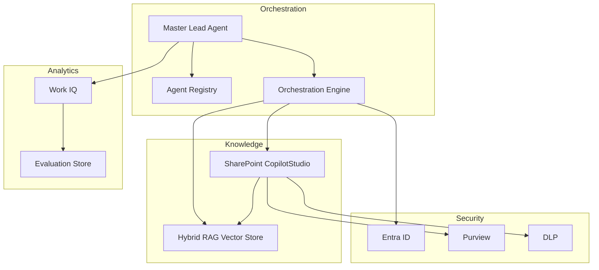

# System Architecture

## Overview

This architecture defines the production design for the Copilot Studio Dream Team enterprise implementation. It emphasizes clear separation between orchestration, knowledge management, security, and evaluation.

## Architectural Layers

### 1. Orchestration Layer

- **Master Lead Agent**: central coordinator that routes requests, enforces policy, and manages child agent handoffs.
- **Agent Registry**: configuration store of agent capabilities, tool permissions, identity mappings, and evaluation hooks.
- **Orchestration Engine**: uses Copilot Studio Tools Framework and connected-agent patterns to execute workflows.

### 2. Knowledge Layer

- SharePoint `CopilotStudio` site collection as the authoritative knowledge repository.
- Metadata-driven content model and term store taxonomy.
- Hybrid RAG vector store for semantic retrieval.

### 3. Security & Governance Layer

- Entra ID managed identities for agents and service principals.
- Microsoft Purview sensitivity labels and DLP policies for content.
- Audit logging and evaluation tracking in Work IQ.

### 4. Analytics Layer

- Work IQ dashboards for behavior, confidence, and compliance.
- Evaluation criteria and feedback loops to detect drift.
- Use analytics for continuous improvement and governance reporting.

## Component Diagram

## Runtime Flow

1. User submits a query to Copilot Studio.
2. Master Lead validates intent, classifies sensitivity, and selects agents.
3. The selected child agent consults SharePoint metadata and/or RAG sources.
4. If required, Security Auditor reviews and approves the response.
5. Work IQ captures the response path, confidence score, and policy status.
6. The user receives a response with source citations and compliance context.

## Key Principles

### Explicit Routing

The Master Lead must decide the exact agent route. It should never delegate route selection entirely to an internal model without explicit orchestration rules.

### Metadata-Driven Knowledge

All retrieval decisions must use SharePoint metadata tags and term store values. If metadata is incomplete, the request should be escalated to Knowledge Architect before production response.

### Guardrails Before Generation

Tool-first operations (metadata lookup, vector search, label check) must occur before any natural language output generation.

### Evaluation as a First-Class Output

Every response must generate evaluation metadata with a score, source trace, and risk status. That data is the basis for training and continuous improvement.

## Deployment Considerations

- Deploy the orchestration engine and agent registry as versioned artifacts in the `copilot-studio-dream-team` repository.
- Keep SharePoint provisioning scripts in `scripts/` and use them for repeatable environment setup.
- Use `dashboards/` definitions to ensure analytics and evaluation criteria are explicitly implemented.

## Integration Points

- Copilot Studio: agent runtime and tools integration
- SharePoint Online: knowledge content and metadata store
- Azure OpenAI / Copilot Studio RAG service: semantic retrieval and generation
- Microsoft Purview: classification, sensitivity, DLP enforcement
- Entra ID: agent identity and access control
- Work IQ: analytics, evaluation, and governance reporting
